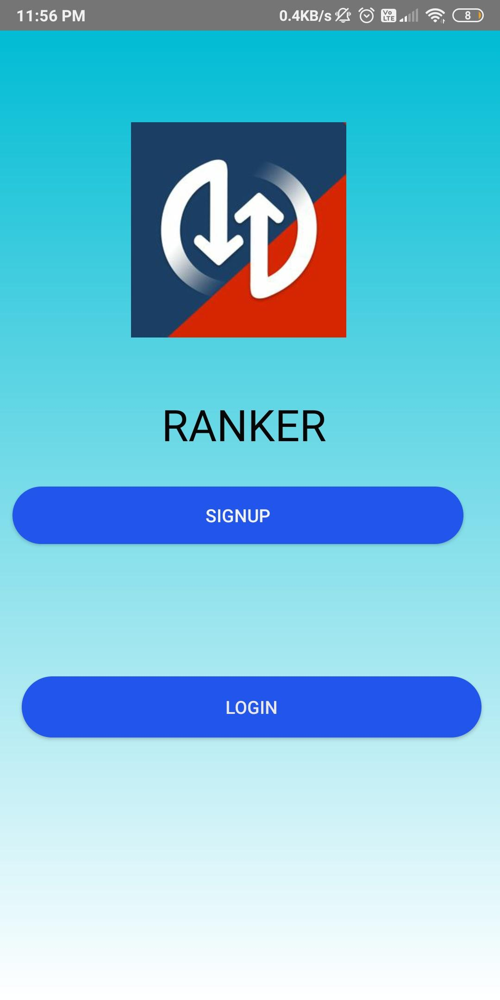
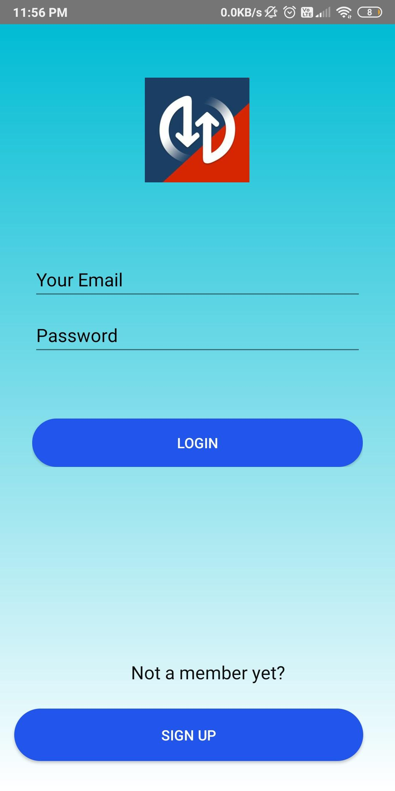
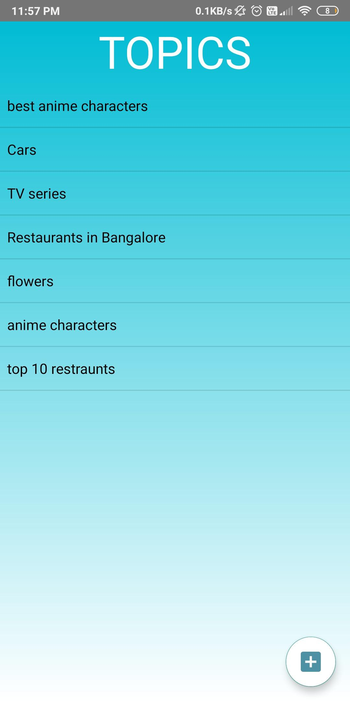
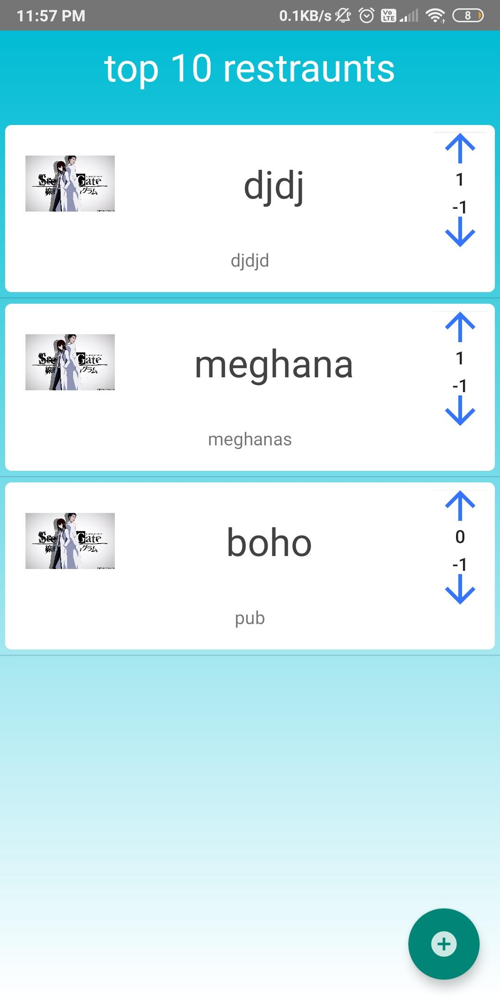
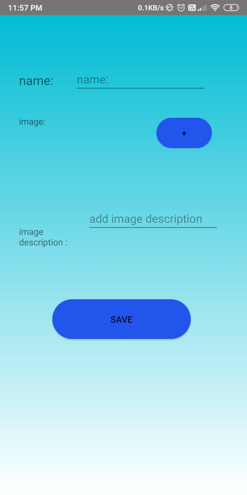
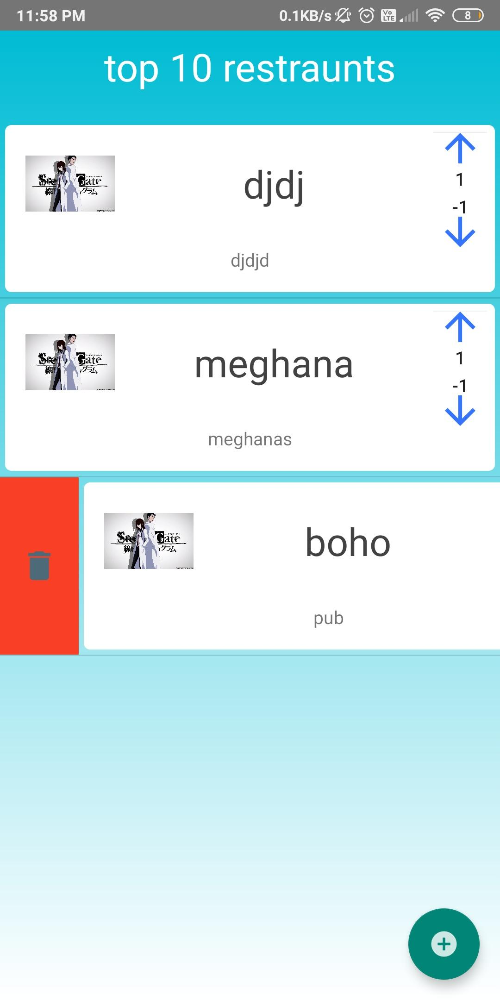

# ranker

This application lets users to post topics and their respective sub-post , who can be upvoted or downvoted (eg: topic : car companies , sub-post: toyota,hyndai, bmw,benz,etc,). the users can then upvote or downvote a sub-post and the ordering of the sub-posts change according to a value called order_value(= upvote+downvote ,downvotes are represented by negative numbers).

# softwares used

development language : Java

user authentication service : Firebase 

database uses: Firebase real time database

# how to start the application 

each project uses a different configuration file , you need to create a project in firebase  and get the google-services.json file from firebase console and move it to your app level of your project in android studio.

Refer to this link for more information : https://firebase.google.com/docs/android/setup

# features that need to be implemented

currently there is no feature that accepts pictures from user for sub-posts, a default picture is used.
deletion of topics 
a page that shows all the topics added by the user.

# some images of the application

Login page  

Registration page  

Topics page  

Subtopics  

Add image and subtopic (only the user who creates the topic can add or delete the subtopics)  

Delete subtopic  

 
 # imgur post , which contains the same images as above.
 https://imgur.com/gallery/8ZF73N7
